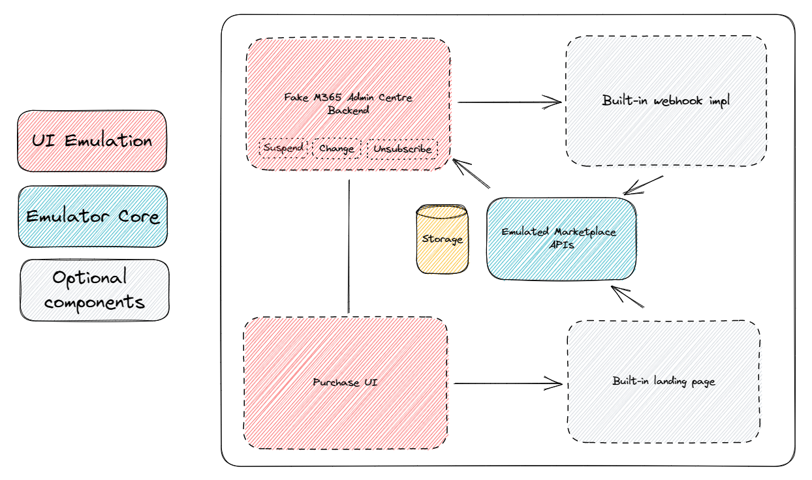
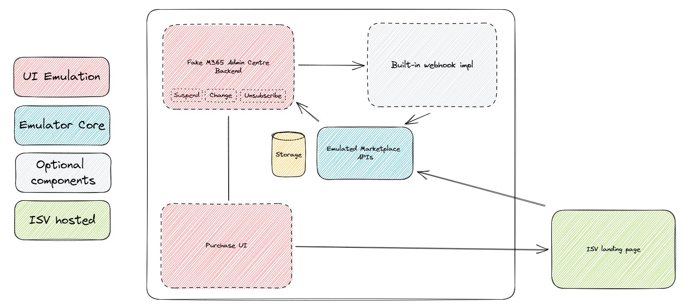
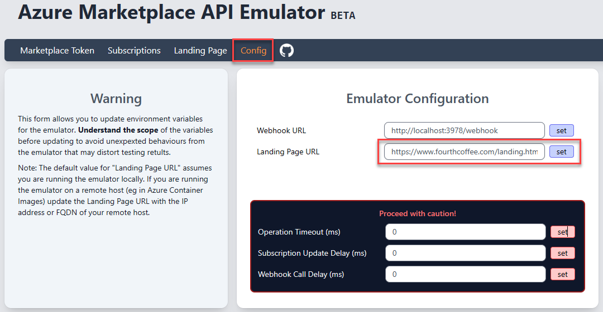
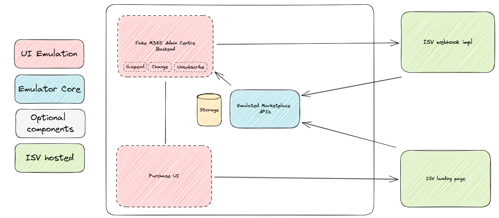

# Emulator Scenarios

## Scenario 1 - Out-Of-Box experience (default configuration)

**Note:** If the emulator is hosted in an environment outside of "localhost" (For example, in an Azure App Service), the landing page url will need to be configured with the url of the host. Either IP address or fully qualified domain name will work as long as you can navigate to "{host-address}/landing.html" in a browser.

In this situation, the landing page configuration value is configured in the same way as Scenario 2!

## Scenario 2 - ISV hosted landing page

If you have built a landing page, or are in the process of building and would like to test the _resolve_ and _activate_ API calls, the emulator can be configured to launch your landing page after an emulated purchase.

This configuration value can be set through the UI: Navigate to the emulator interview, select _config_, set the _Landing Page URL_ and click _set_.

**Note:** Changing the value through the use interface will only persist the new value for the duration of the session. If the emulator is restarted, this value will be lost and will need to be reconfigured.

To make this value persistent across restarts, set the environment variable `LANDING_PAGE_URL` instead.

## Scenario 3 - ISV hosted landing page and webhook

This configuration value can be set through the UI: Navigate to the emulator interview, select _config_, set the _Webhook URL_ and click _set_.

**Note:** Changing the value through the use interface will only persist the new value for the duration of the session. If the emulator is restarted, this value will be lost and will need to be reconfigured.

To make this value persistent across restarts, set the environment variable `WEBHOOK_URL` instead.